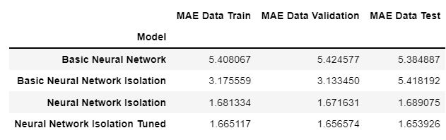

# Surgre-Pricing-Algorithm-with-Neural-Network

On this project, i want to share how problem of car availbility on Uber can be solved using surge pricing. To apply surge pricing, i use data analytics to describe the pattern using Tableau and predict fare amount each customer based on particular condition using Neural Network regression method (Deep Learning).

 
For full report of this project, please visit <a href="[https://github.com/Juantonios1/Absenteeism-Analysis-to-Improve-Work-Performance/blob/main/Absenteeism%20Analysis%20ipynb/Absenteeism%20Analysis%20to%20Improve%20Work%20Performance.ipynb](https://github.com/Juantonios1/Surgre-Pricing-Algorithm-with-Neural-Network/blob/main/Uber%20Analysis%20Ipynb/Uber%20Fare%20Analysis%20Final.ipynb)">Surge pricing algorithm with neural network</a>.

## Summary Process
<!-- TABLE OF CONTENTS -->

  
Table of Content

  <ol>
    <li><a href="#business-background">Business Background</a></li>
    <li><a href="#data-understanding">Data Understanding</a></li>
    <li><a href="#feature-engineering">Feature Engineering</a></li>
    <li><a href="#exploratory-data-analysis">Exploratory Data Analysis</a></li>
    <li><a href="#data-preprocessing">Data Preprocessing</a></li>
    <li><a href="#data-analytics">Data Analytics</a></li>
    <li><a href="#modeling">Modeling</a></li>
    <li><a href="#model-visualization">Model Visualization</a></li>
    <li><a href="#conclusion">Conclusion and Recommendation</a></li>
    <li><a href="#contributors">Contributors</a></li>
  </ol>

## Business Background
**Context :**  
Uber is an American app-based transportation platform headquartered in San Francisco, California who develop an app that connects drivers to users who need a ride, using a smartphone as a tool. The Uber Business Model is also known as a Multisided Platform Business Model, as it connects drivers (offer) and passengers (demand), in order to offer cheaper transportation and an additional source of income. The customer must use the Uber app to book a ride and then enter the customer's destination before the trip takes place. When the customer arrives at the destination, the journey ends. Fares are automatically calculated and charged to the payment method the customer connects to the Uber account.

**Problem Statement :**  
One of the biggest problem from Uber as ride hailing company is availability of drivers at certain times (rush hours or bad weather conditions) and certain locations in some cities. The best way to solve that problems is use Surge Pricing. Surge Pricing / Dynamic Pricing (Flexible Pricing) is where prices change constantly based on market fluctuations. For that, Uber need system and algorithm to make prediction for fare amount based on some feature on history data.

**Goals :**  
The goals of this analysis are to know the price per transaction according to particular conditions (the time, distance traveled, etc) so surge pricing can be applied.

## Data Understanding

| Feature      	     | Description                                                      |
|--------------------|------------------------------------------------------------------|
| Key        	       | Unique ID for customer                          	                |
| Fare Amount        | The cost of each trip in USD.                                  	|
| Pickup Datetime    | Date and time when the meter was engaged.                        |
| Passanger Count    | The number of passengers in the vehicle (driver entered value).  |
| Pickup Longitude   | The longitude where the meter was engaged.                    	  |
| Pickup Latitude    | The latitude where the meter was engaged.                        |
| Dropoff Longitude  | The longitude where the meter was disengaged.                    |
| Dropoff Latitude   | The latitude where the meter was disengaged.                     |
                                                                                                   
## Feature Engineering
At this stage, to enrich the information from the existing data, a feature engineering process can be carried out, with results:
| Feature      	     | Description                                                      |
|--------------------|------------------------------------------------------------------|
| Year        	     | The year when the meter was engaged.                          	  |
| Month              | The month when the meter was engaged..                           |
| Day                | The day when the meter was engaged.                              |
| Day Name           | Day name when the meter was engaged.                             |
| Hour               | The hour when the meter was engaged..                            |
| Minute             | The minute when the meter was engaged.                           |
| Week               | The week when the meter was engaged.                             |
| Weekend            | Determine the day is weekend or weekday.                         |
| Distance           | The distance from start point to end point(in km).               |

## Exploratory Data Analysis
At this stage, a brief analysis of the data will be carried out, as follows:
* Distribution Data
* Data Correlation

* Outliers Test

## Data Preprocessing
At this stage, data preparation and processing will be carried out before being used as a data model, as follows:
* Outliers Isolation
* Scalling
* Splitting

## Data Analytics
At this stage, another information analysis will be carried out, as follows:
* Orders Information  
  
* Transaction Activity  
  
* Transaction Summary  
  
* Transaction History  
  
You can also see full dashboard of analysis at <a href="https://public.tableau.com/app/profile/juan1691/viz/UberTransactionAnalysis/UberTransactionsAnalysis?publish=yes">Analysis Tableau</a>.  

## Modeling
At this stage will be done making and optimizing the deep learning model, as follows:
* Comparison dataset(Without outliers isolation & With outliers isolation)
* Adjust model
* Hyperparameter Tuning

## Model Visualization
At this stage there will be an explanation in the decision making of deep learning model, in the following ways:
* Summary Model

## Conclusion 
We conclude our result and give recommendation based on it
* Summary Model  
   
* Business Insight
  * With this algorithm, Company can determine fare amount not only based on distance, but can be day or time so the price more suitable for consumer, driver, and company.
* Recommendation
  * Need a model to describe what factor which affect fare amount.
  * Add more feature to make model more accureate (City, Holiday, Event, etc)
 
For full report of this project, please visit <a href="[https://github.com/Juantonios1/Absenteeism-Analysis-to-Improve-Work-Performance/blob/main/Absenteeism%20Analysis%20ipynb/Absenteeism%20Analysis%20to%20Improve%20Work%20Performance.ipynb](https://github.com/Juantonios1/Surgre-Pricing-Algorithm-with-Neural-Network/blob/main/Uber%20Analysis%20Ipynb/Uber%20Fare%20Analysis%20Final.ipynb)">Absenteeism at Work</a>.

## Contributors:
Juan Antonio Suwardi - antonio.juan.suwardi@gmail.com  

